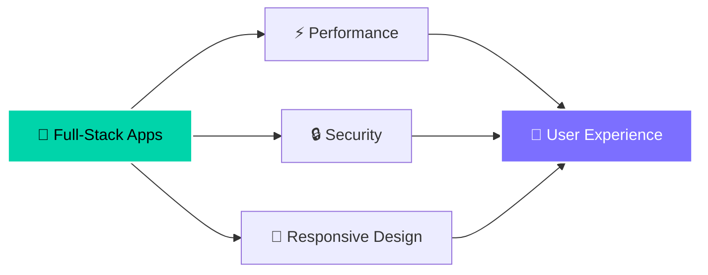

<div align="center">


</div>

<div align="center">

[](https://git.io/typing-svg)

</div>

---

## 👨‍💻 About Me

```go
package main

func main() {
    me := Developer{
        Name:     "Houssam Alhyane",
        Location: "Morocco 🇲🇦",
        Username: "@skizman",
        Role:     "Full-Stack Developer",
        Languages: []string{"Go", "Java", "JavaScript", "PHP", "HTML5", "CSS3"},
        Databases: []string{"MySQL", "MongoDB"},
        Tools:     []string{"Git","Docker","Linux", "Tailwind CSS"},
        CurrentFocus: "Building scalable web applications",
    }
    fmt.Printf("Hi! I'm %s from %s 👋\n", me.Name, me.Location)
}
```

---

## 🛠️ Tech Stack

<div align="center">

### 💻 Languages & Core Technologies


### 🗄️ Databases


### 🔧 Tools & Frameworks


</div>

---

## 🎯 What I'm Currently Working On

<div align="center">



</div>

- 🔭 Building **scalable web applications** with modern architectures
- 🌱 Deep diving into **Go microservices** and distributed systems
- 💡 Exploring **DevOps practices** and containerization
- 🤝 Open to collaborating on **open-source projects**

---

## 💼 Featured Projects

<div align="center">

<table>
<tr>
<td width="50%" valign="top">

### 🌟 Project Highlight 1
**Tech Stack:** Go, Docker, MongoDB

A brief description of your most impressive project. What problem does it solve? What technologies did you use?

`⭐ Star` | `🍴 Fork` | `👁️ Watch`

</td>
<td width="50%" valign="top">

### 🚀 Project Highlight 2
**Tech Stack:** Java, MySQL, Tailwind CSS

Another amazing project you've built. Showcase the impact and the technical challenges you overcame.

`⭐ Star` | `🍴 Fork` | `👁️ Watch`

</td>
</tr>
<tr>
<td width="50%" valign="top">

### 💡 Project Highlight 3
**Tech Stack:** JavaScript, Node.js, MongoDB

Describe your third featured project and what makes it special or unique in your portfolio.

`⭐ Star` | `🍴 Fork` | `👁️ Watch`

</td>
<td width="50%" valign="top">

### 🎨 Project Highlight 4
**Tech Stack:** PHP, MySQL, Bootstrap

Share another project that demonstrates your diverse skill set and problem-solving abilities.

`⭐ Star` | `🍴 Fork` | `👁️ Watch`

</td>
</tr>
</table>

</div>

---

## 🏆 Achievements & Certifications

<div align="center">

| 🎯 Achievement | 📅 Year | 🔗 Link |
|:--------------|:-------:|:-------:|
| **Achievement 1** | 2024 | [View](https://link.com) |
| **Achievement 2** | 2024 | [View](https://link.com) |
| **Achievement 3** | 2023 | [View](https://link.com) |

</div>

---

## 📚 Latest Blog Posts

<div align="center">

<!-- BLOG-POST-LIST:START -->
- 📝 [Your latest blog post title here](https://dev.to/skizman)
- 🚀 [Another interesting article you wrote](https://dev.to/skizman)
- 💡 [Tutorial or guide you published](https://dev.to/skizman)
<!-- BLOG-POST-LIST:END -->

➡️ [**More posts on Dev.to...**](https://dev.to/skizman)

</div>

---

## 🌐 Connect With Me

<div align="center">

[](https://dev.to/skizman)
[](https://discord.com/channels/@skizman_23)
[](https://linkedin.com/in/yourprofile)
[](https://twitter.com/yourhandle)

</div>

---

## 💭 Random Dev Quote

<div align="center">


</div>

---

<div align="center">

### 💡 "Code is like humor. When you have to explain it, it's bad." – Cory House


</div>
